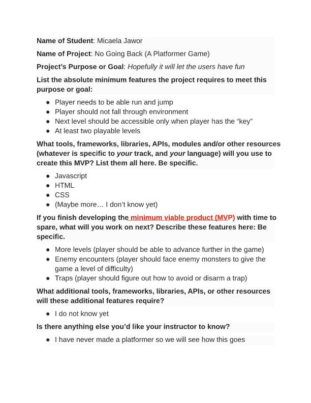
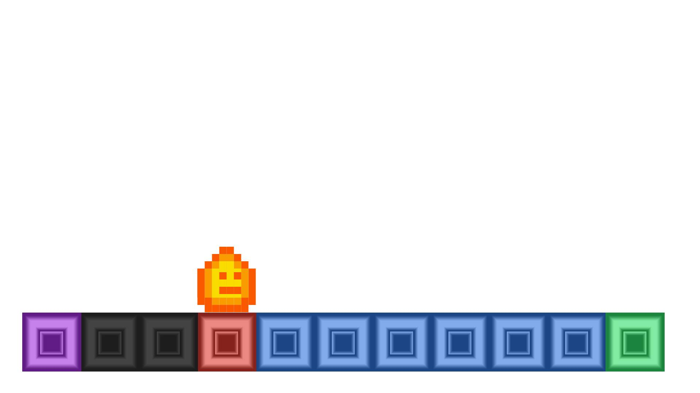
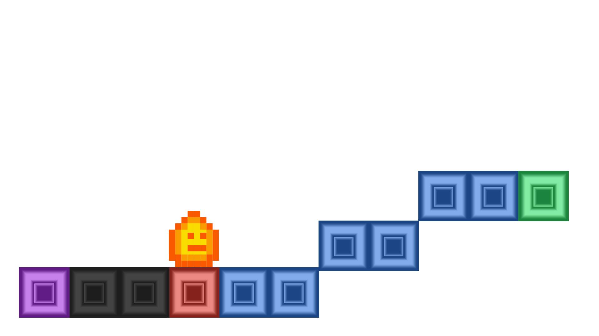
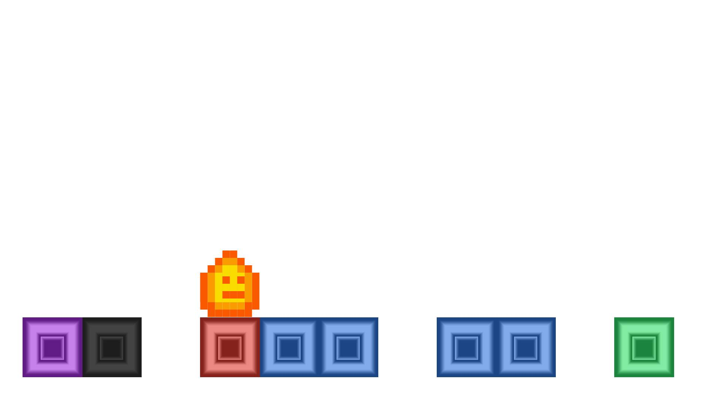
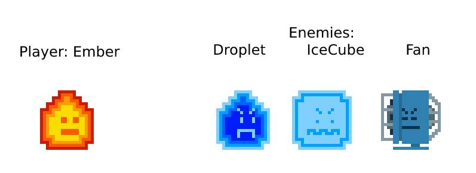

# | **No Going Back - A Platformer Game** |

|  |
|:-----:|
| [**Micaela**](https://github.com/MicaelaDJ) |

### Project No Going Back - created May 10th, 2019
#### By Micaela Jawor

----------

## Description
'No Going Back' is a platformer game designed using HTML and JavaScript, where you play as a simple ember trying to find his own candle. As the player, navigate through the levels, where each movement forward is final, returning to a burnt tile will only cause an early End Game. Face dire enemies, such as Ice Cubes, Water Droplets, and Electric Fans. Be careful of your movement choices, because sometimes your greatest enemy is yourself. The game features original story, levels, expandable core mechanics, and artwork.

## Project Proposal

## Some Level Design
##### Level 1

##### Level 2

##### Level 3

## Characters
##### CharactersS

## Known Bugs

* None yet.

## Specifications

| Behavior | Input | Output |
|----------|:------:|:-----:|
| Game recognizes player by name | Name | Add Name to Game |
| Player experiences the intro exhibition | Start Game | Player Objective |
| Move right | 'D' key or 'right arrow' | Player moves right |
| Move left | 'A' key or 'left arrow' | Player moves left |
| Jump | 'W' key or 'up arrow' | Player jumps |
| Player attacks enemy | 'space bar' | Enemy Damaged |
| Enemy attacks player | Enemy Turn | Player Damaged |
| Functional battle | Player/Monster Turn Change | Dynamic Damage |
| Player can pick up and use key | 'K' key Get / Use | Selected Item Retrieved or Used |
| Player completes level | Perform Level | Receive Reward |
| Player experiences the epilogue | Win Game | High Score Board (based on time and attempts/level) |

## Setup and Use

#### Prerequisites

To setup or use this webpage:
* Must have a working browser and/or IDE
* Must have basic computer use proficiency

##### View Online
Visit my [GH-Page hosted site](https://micaeladj.github.io/No-Going-Back/) micaeladj.GitHub.io/No-Going-Back/

##### Open Locally
1. Navigate to [the game repo](https://github.com/micaeladj/No-Going-Back) GitHub.com/micaeladj/No-Going-Back
2. Clone the repository using the [HTTPS URL](https://github.com/micaeladj/No-Going-Back)
3. Open the index.html file with your preferred browser to view website, or alternately use an IDE to view the code.

## Built With

* Visual Studio Code
* HTML/CSS/Bootstrap
* JavaScript/jQuery-3.3.1
* GitHub Pages
* Photopea

## Contact

| Author | GitHub | Email |
|--------|:------:|:-----:|
| Micaela Jawor | [MicaelaDJ](https://github.com/MicaelaDJ) |  [micaelajawor@yahoo.com](mailto:micaelajawor@yahoo.com) |
## Credits

| | Micaela Jawor |
|-|:------------:|
| **Design** |
| Artwork |◈|
| Core Mechanics |◈|
| Gameplay |◈|
| Story |◈|
| User Interface |◈|
| **Writing** |
| Flavor Text |◈|
| Story Text |◈|
| **Programming** |
| Back-End |◈|
| Front-End |◈|
| Refractoring |◈|
| **Graphics** |
| Backgrounds |◈|
| Characterrs |◈|
| Icons |◈|
| **Quality Assurance** |
| Documentation |◈|
| Testing |◈|

## Support and contact details

If you have any feedback or concerns, please contact me at the email provided under 'Contributor'.

